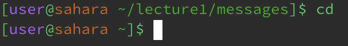
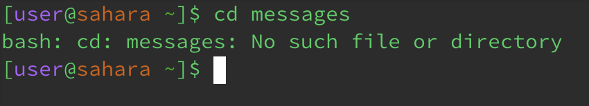
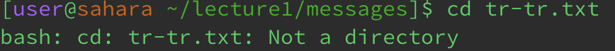
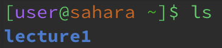
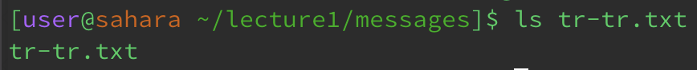
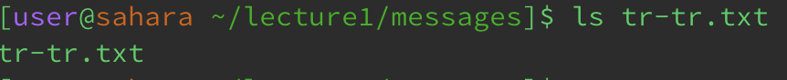
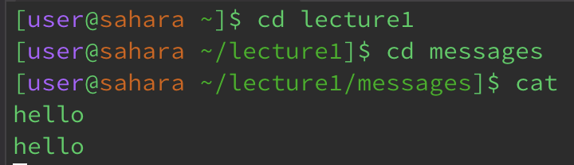
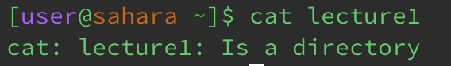
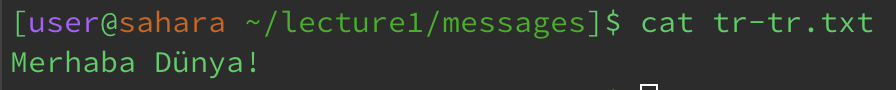

# **Lab Report 1**

## Commands

`cd`

When the cd command is used with no arguments, your current directory is changed to the home directory.

When the cd command is used with a path to a directory, it will change your current directory to the specified directory if it is present within your current directory.

When the cd command is used with a path to a file, it will produce an error because the command is only intended to be used with directories.

---

`ls`

When the ls command is used with no arguments, it lists the directories and files present within your current directory.

When the ls command is used with a path to a directory, as long as the specified directory is present within your current directory, it lists the directories and files present within that specified directory.

When the ls command is used with a path to a file, it will typically list the name of the specified file.

---

`cat`

When the cat command is used with no arguments, it typically waits for text input from the user and then prints that input text back to the terminal.

When the cat command is used with a path to a directory, it will typically produce an error because the command is primarily intended to be used with files, not directories.

When the cat command is used with a path to a file, it will indeed print the contents of that file to the terminal.
