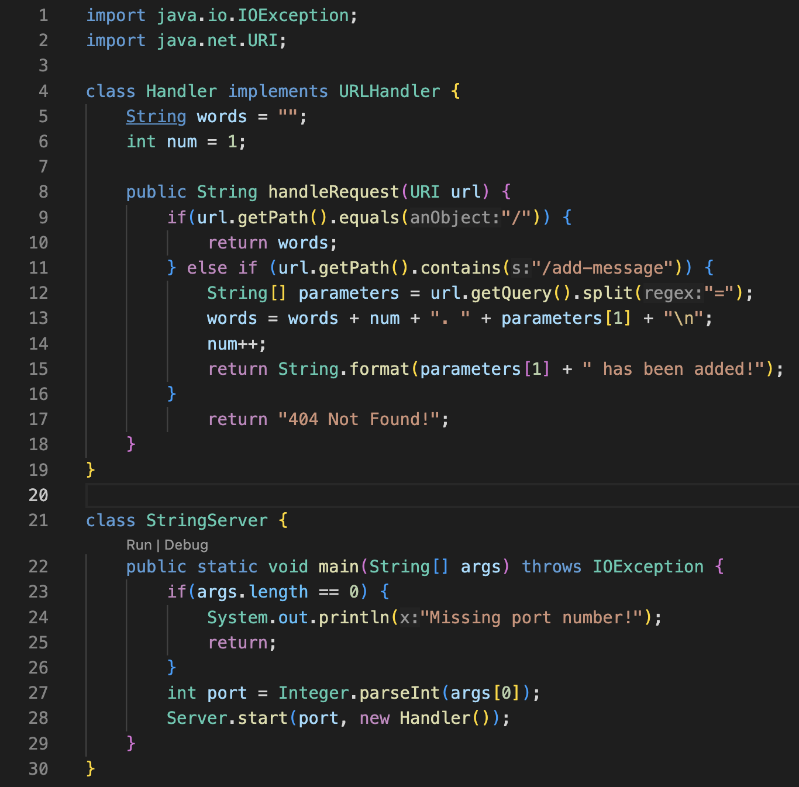
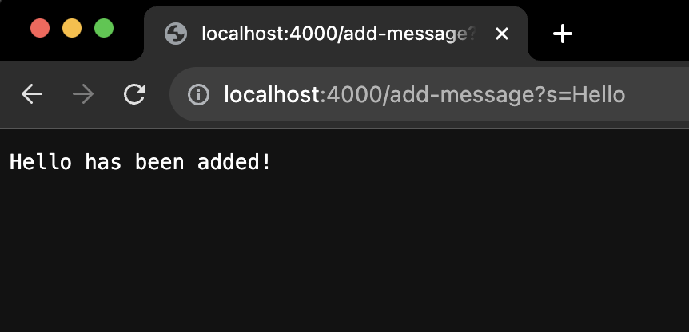
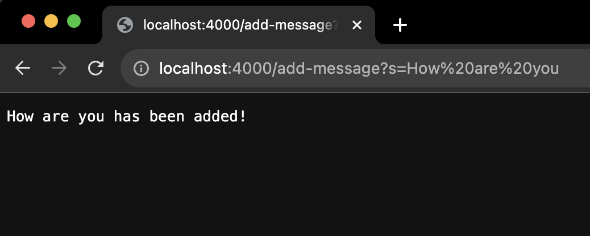
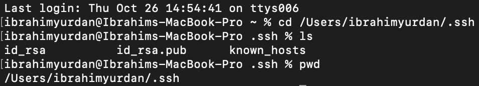
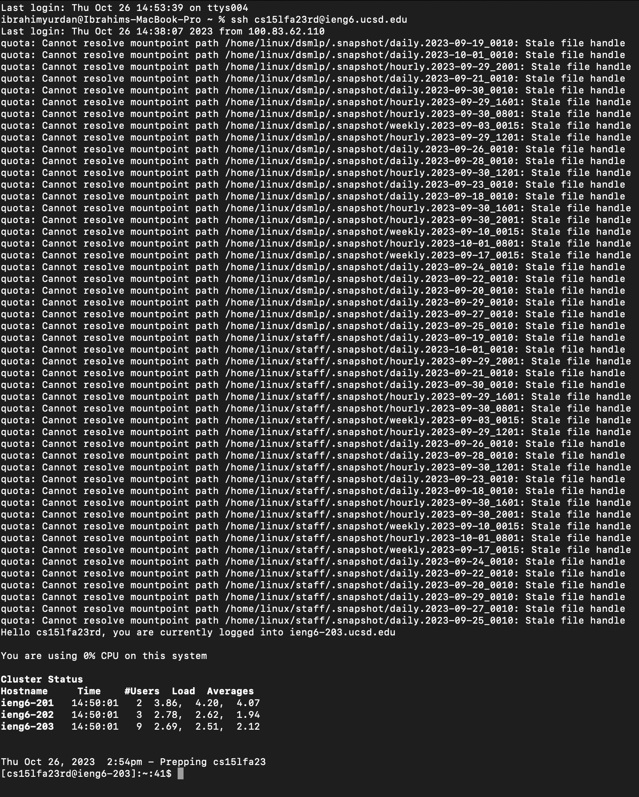

# Lab Report 2

## Part 1

**StringServer Code**

**"Hello"**

In the `/add-message` request, the `handleRequest` method is called, and it uses the URL to detect the `/add-message path`. The provided message is added to the `words` string, and the `num` count is increased to maintain the total number of messages. The method then responds by confirming the successful addition of the message.

**"How are you"**

In the `/add-message` request, `handleRequest` is called, and it checks if the URL contains `/add-message`. If it does, the `parameters` array stores the new message. The `words` string is updated with the new message, and the `num` count increases. Finally, a confirmation message is returned.

---

## Part 2

I am not sure why there are so many quotas but it works.

---

## Part 3

I learned how to use my GitHub more efficiently by switching from github.com to github.dev, which greatly simplified managing my lab projects. This switch streamlined tasks such as adding and deleting files and folders, as well as reorganizing them.