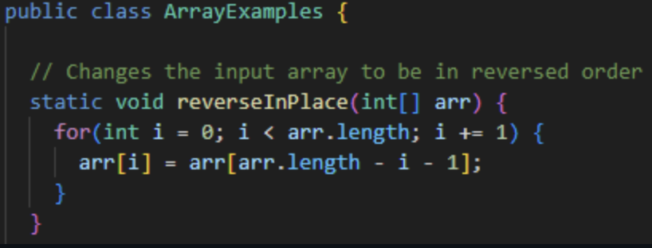

# Lab Report 3

## Part 1

### **List Examples `reverseInPlace` method:**



### Failure Inducing Input:

JUnit Test:
```
@Test 
public void testReverseInPlace() {
    int[] input1 = { 3, 2, 1 };
    ArrayExamples.reverseInPlace(input1);
    assertArrayEquals(new int[]{ 1, 2, 3 }, input1);
}
```
Input: `{ 3, 2, 1 }`

Expected: `{ 1, 2, 3 }`

Actual: `{ 1, 2, 1 }`
### Non-Failure Inducing Input:

JUnit Test:
```
@Test 
public void testReverseInPlace() {
    int[] input1 = { 3 };
    ArrayExamples.reverseInPlace(input1);
    assertArrayEquals(new int[]{ 3 }, input1);
}
```

Input: `{ 3 }`

Expected: `{ 3 }`

Actual: `{ 3 }`
### Symptom:

Failure:


No failure:


### Bug:

Before:

```
static void reverseInPlace(int[] arr) {
    for(int i = 0; i < arr.length; i += 1) {
      arr[i] = arr[arr.length - i - 1];
    }
}
```

After:
```
static void reverseInPlace(int[] arr) {
    for(int i = 0; i < arr.length / 2; i += 1) {
      int temp = arr[i];
      arr[i] = arr[arr.length - i - 1];
      arr[arr.length - i - 1] = temp;
    }
}
```
Instead of going through the whole list and swapping items when it's no longer necessary, this method goes through only half of the list and stops before reaching the other half. It uses a temporary variable to hold the value of the current item so that it can be swapped with its counterpart later on.

## Part 2

### `find`

## `-name` (Search by Name)

This option allows finding files by their names or patterns.

`Finding Files with a Specific Name`

```
find ./technical -name "file.txt"

Output:

./technical/file.txt
```

This command searches within the `./technical` directory for a file named `file.txt` and displays its path if found.

`Finding Files with a Pattern Match`

```
find ./technical -name "*.log"

Output: 

./technical/logfile.log
./technical/debug.log
```

Here, it searches within `./technical` for files with names ending in `.log` and shows their paths.

[Source: Linuxize - Find Command in Linux](https://linuxize.com/post/how-to-use-linux-find-command/)

## `-size` (Search by Size)

This option enables searching for files based on their sizes.

`Finding Files Larger Than 1MB`

```
find ./technical -size +1M

Output:

./technical/large_file.mp4
```

It displays files within `./technical` larger than 1MB.

`Finding Files Smaller Than 100KB`

```
find ./technical -size -100k

Output:

./technical/small_file.txt
```

This command shows files within `./technical` smaller than 100KB.

[Source: GeeksforGeeks - Find Command in Unix](https://linuxize.com/post/how-to-use-linux-find-command/)

## `-type` (Search by Type)

This option allows searching for files based on their types.

`Finding Directories`

```
find ./technical -type d

Output:

./technical/folder1
./technical/folder2
```

It lists all directories within the `./technical` directory.

`Finding Regular Files`

```
find ./technical -type f

Output:

./technical/file1.txt
./technical/file2.jpg
```
This command displays all regular files within the `./technical ` directory.

[Source: The Linux Command Line](https://linuxcommand.org/lc3_man_pages/find1.html)

## `-exec` (Execute Commands)

Allows executing commands on the found files or directories.

`Deleting Files Found`

```
find ./technical -name "*.tmp" -exec rm {} \;

Output: 
Files named *.tmp are deleted.
```

This command finds all files with the ".tmp" extension within `./technical` and removes them.

`Changing File Permissions`

```
find ./technical -type d -exec chmod 755 {} \;

Output:

Directory permissions are modified.
```

Finds all directories within ./technical and changes their permissions to 755.

[Source: The GNU Utilities](https://www.gnu.org/software/findutils/manual/html_mono/find.html)