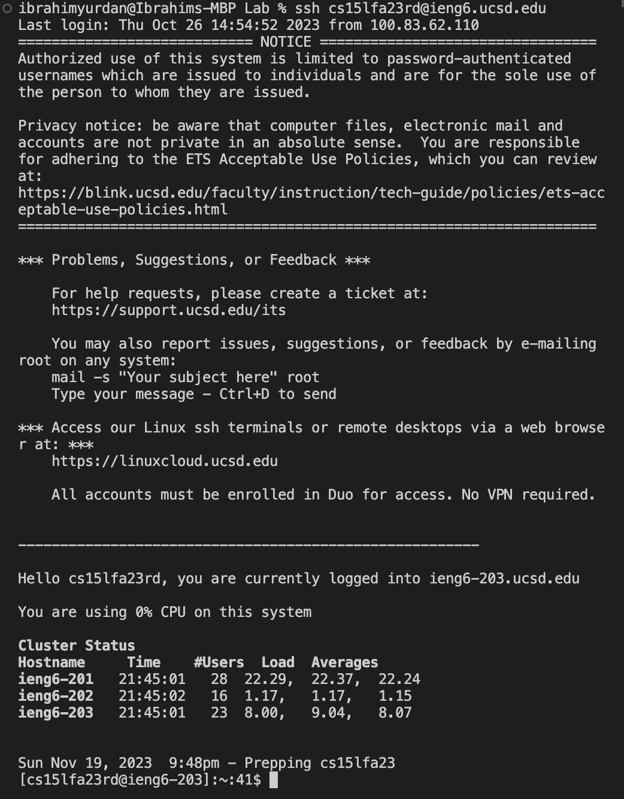
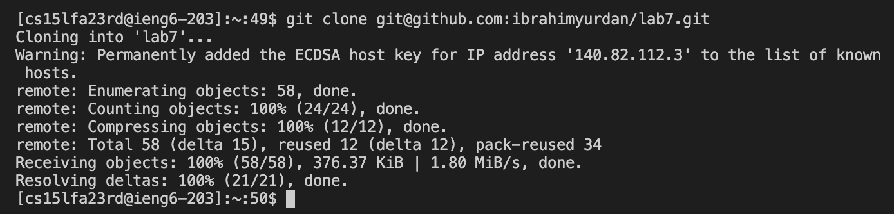
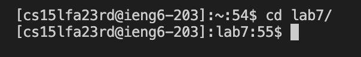
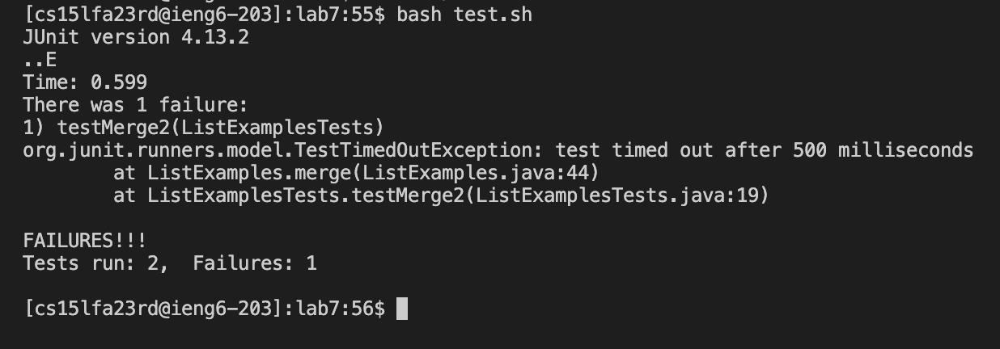
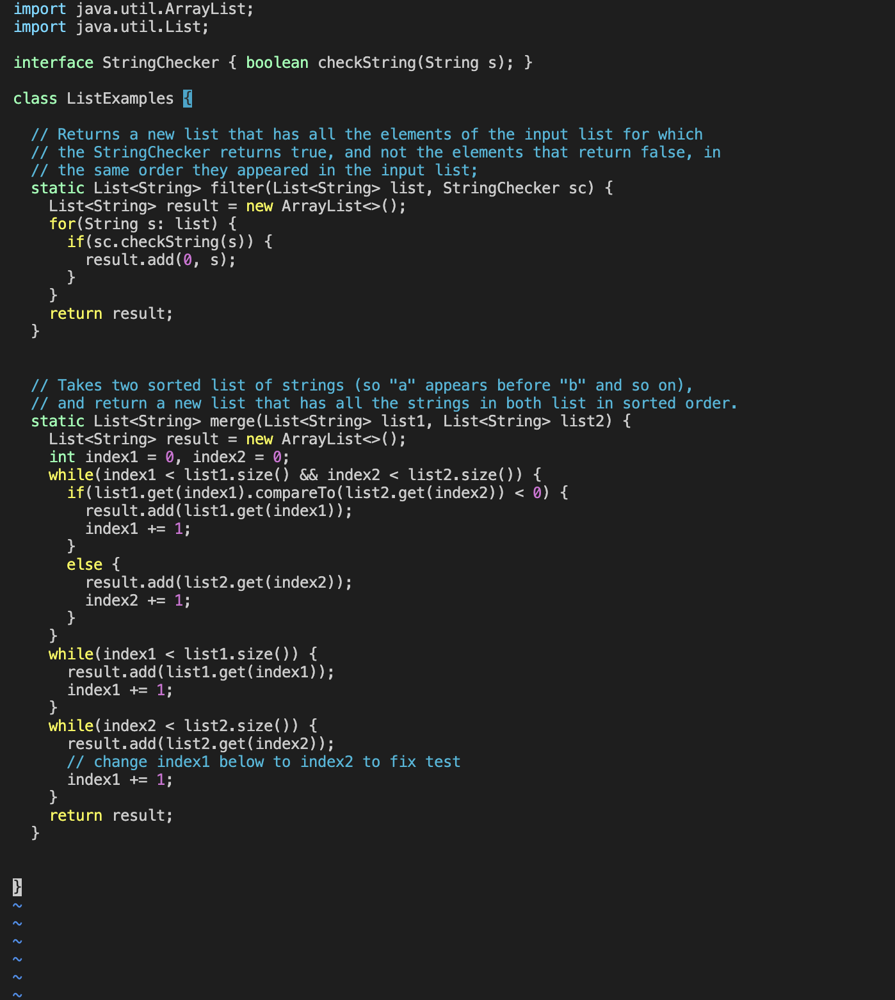
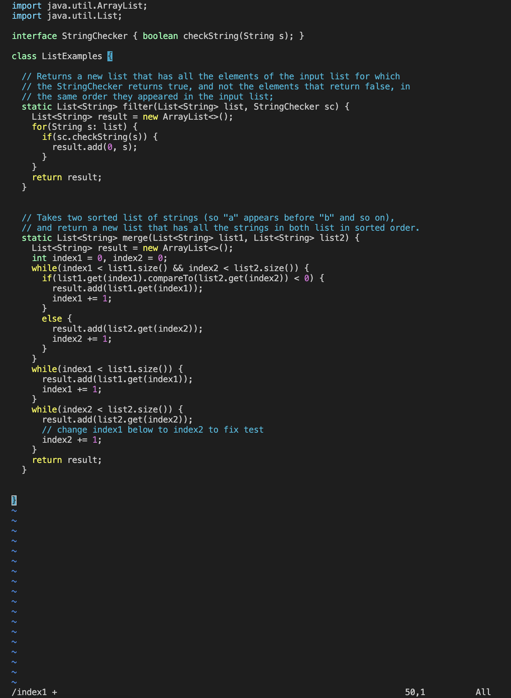
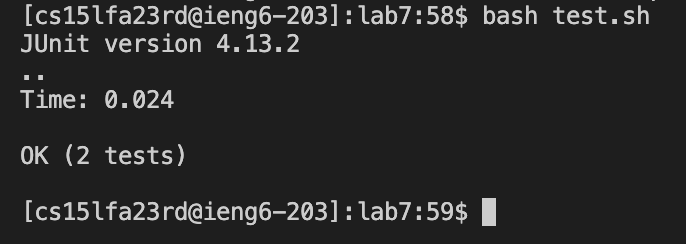

# Lab Report 4

## Step 4

Log into ieng6

```
ssh cs<tab><enter>
```

`ssh` into `cs15lfa23rd@ieng6-203.ucsd.edu`.



## Step 5

Cloning fork of the repository from the GitHub account (using the `SSH` URL).

```
git clone git@github.com:ibrahimyurdan/lab7.git<enter>
```

`git clone` cloning the repository.



## Step 6

Running the tests, showing that they will fail.

```
cd l<tab><enter>
```

Change directory `lab7`.



```
bash t<tab><enter>
```

Using `bash` command to run the `test.sh` script.



## Step 7

Editing the code to fix the failing test.

```
vim Li<tab>.<tab><enter>
```

Using `vim` to open `ListExamples.java`.



```
/index1 +<enter>nner2
```

The `/` command is used to search for a pattern defined as `index1 +`. Following that, we can use `<enter>nn` to locate the third occurrence of the pattern, with each `n` iterating one instance of the pattern. Typing `e` moves the cursor to the end of the word `index1`, placing it just before `1`. Subsequently, the `r2` command is employed to replace `1` with `2`.



```
:wq
```

`w` writes the changes to the file and `q` exits the file.


## Step 8

Running the tests, they now succeed.

```
bash t<tab><enter>
```

Using `bash` to run `test.sh`.



## Step 9

Commit and push the changes to the Github account.

```
git add .<enter>

git commit -m "fixed an issue where merge would increment the wrong index"<enter>

git push origin main
```

`git add .` This command stages all files for the next commit by adding them to the staging area.

`git commit -m "<message"` This command commits all staged files with a message, creating a snapshot of changes in the repository.

`git push origin main` This command pushes all commits to the remote repository named `origin`, specifically from the `main` branch.

