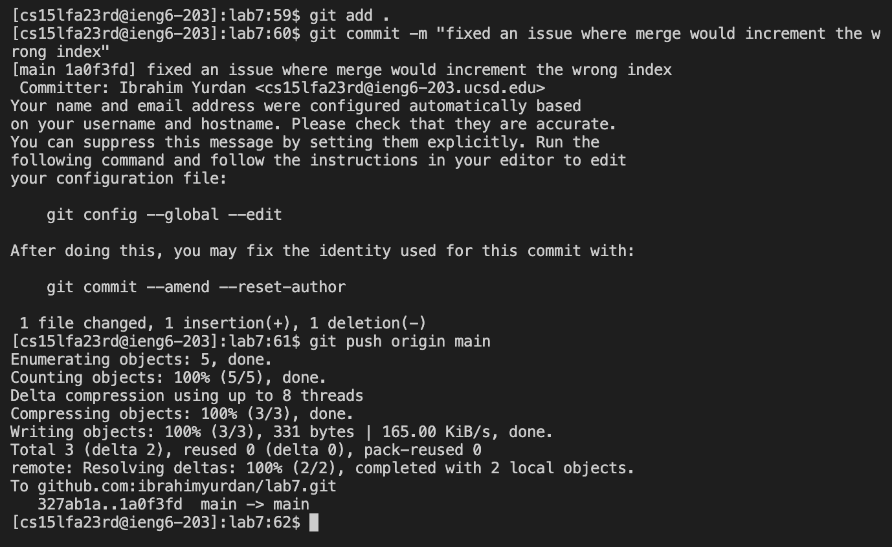

# Lab Report 4

## Step 4

Log into ieng6

```
ssh cs<tab><enter>
```

`ssh` into `cs15lfa23rd@ieng6-203.ucsd.edu`.


## Step 5

Cloning fork of the repository from the GitHub account (using the `SSH` URL).

```
git clone[<shift><ins>]<enter>
```
`<shift><ins>` is the paste hot key for git bash terminal.

`git clone` cloning the repository.


## Step 6

Running the tests, showing that they will fail.

```
cd l<tab><enter>
```

Change directory `lab7`.


```
bash t<tab><enter> 

(im not sure how to minimize more than this. maybe bash t<up><enter>?)
```

Using `bash` command to run the `test.sh` script.


## Step 7

Editing the code to fix the failing test.

```
vim Li<tab>.<tab><enter>
```

Using `vim` to open `ListExamples.java`.


```
/index1 +<enter>nner2
```

`/` command searches for a pattern with the pattern being `index1 +` \
Then we hit `<enter>nn` to find the third occurrence of the pattern with each `n` iterating 1 instance of the pattern \
`e` goes to the end of the word `index1` putting the cursor right before `1` and the `r2` command replaces `1` with `2`


```
:wq
```

`w` writes the changes to the file and `q` exits the file.


## Step 8

Running the tests, they now succeed.

```
bash t<tab><enter>
```

Using `bash` to run `test.sh`.


## Step 9

Commit and push the changes to the Github account.

```
git add .<enter>

git commit -m "fixed an issue where merge would increment the wrong index"<enter>

git push origin main
```

`git add .` `hit <enter>` to complete. This command stages all files for the next commit by adding them to the staging area.

`git commit -m "message"`, `I typed the message but we can <ctrl+v> to paste the message and <enter> to complete.` This command commits all staged files with a message, creating a snapshot of changes in the repository.

`git push origin main` This command pushes all commits to the remote repository named `origin`, specifically from the `main` branch.

